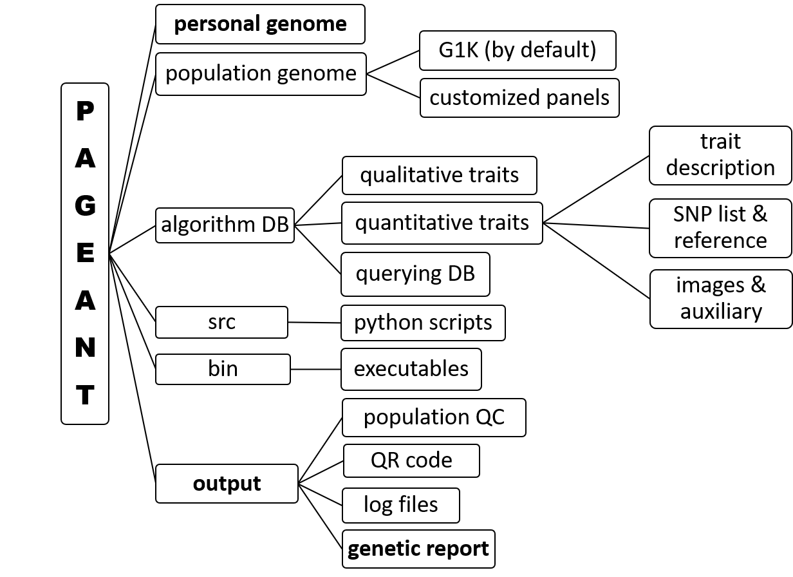

## #1. Download & Run: *for advanced users*

> ## Prepare:
> > - ### [Conda](https://docs.conda.io/en/latest/) (or [Miniconda](https://docs.conda.io/en/latest/miniconda.html)), [Git](https://git-scm.com/), for installing python packages.
> > - ### [PLINK1.9](http://www.cog-genomics.org/plink/1.9/) and [PLINK2.0](http://www.cog-genomics.org/plink/2.0/), named "plink" and "plink2" respectively
> >		#### *set in "PATH", or in the "plink_dir" of the PAGEANT/bin/config.ini file.*
> > - ### For Mac-OS, install [Homebrew](https://raw.githubusercontent.com/Homebrew/install/HEAD/install.sh), and then run "[brew](https://brew.sh/) install zbar llvm". For Linux, run "sudo apt-get install libzbar0".

> ## Download: 
> > ```
> > git clone https://github.com/jielab/pageant.git
> > cd pageant
> > git pull # for getting an updated version
> > conda env create -f environment_linux.yml 
> > # "environment_macos.yml" for Mac-OS, "environment_win.yml" for Windows
> > ```

> > - ### Download [1000 genomes project (G1K) genotype](https://www.internationalgenome.org), to be used as population reference. The basic version of PAGEANT comes with a subset of the G1K data that includes all SNPs used in the genetic report.

> ## Run:
> ### GUI version:
> > - For Windows user using Ubuntu Linux, an upgrade to Windows 11 is recommended, which supports WSL GUI. In Windows Powershell, run "wsl --update" to get the latest version.  
> > ```
> > conda activate pageant
> > python ./GUI.py
> > ```
> ### Command line version:
> > ```
> > conda activate pageant
> > python ./pageant.py -n test -i ./personal_genome/HG001.vcf.gz -o output
> > 
> >```
> ### For 3 APIs:
> > - for umap, first download the [sample information file](ftp://ftp.1000genomes.ebi.ac.uk/vol1/ftp/technical/working/20130606_sample_info) if using 1000 genomes as reference.
> > - for add_rsid, first download the rsids-v*-hg*.tsv.gz file towards the end of [pheweb resource page](https://resources.pheweb.org). Make sure that the chromosome and positions in the input GWAS file is sorted first, by using sort -k 1,1n -k 2,2n.
> > - for liftOver, first download the chain files, for [hg19](http://hgdownload.cse.ucsc.edu/gbdb/hg19/liftOver/) and/or for [hg38](http://hgdownload.cse.ucsc.edu/gbdb/hg38/liftOver).
> > - for help: python pageant.py [API-NAME] --help
> > ```
> > - conda activate pageant
> > - python pageant.py umap -s HG001.vcf.gz -p g1k.vcf.gz -m g1k_samples.txt
> > - python pageant.py add_rsid -i test.gwas.gz --chr chr --pos pos -d rsids-v154-hg19.tsv.gz -o new.gwas.gz
> > - python pageant.py liftOver -i test.gwas.gz --chr chr --pos pos -c hg38ToHg19.over.chain.gz -o new.GWAS.gz
> > - python pageant.py qr_code -s fingerprint_snps.txt -k key
> > ```
<br/>


## #2. Customize PAGEANT

> <b>The folder structures of PAGEANT is shown below. Advanced users could also follow this structure to customize the genetic report.</b> 

> <b>For example, under "algorithm database" folder, there are 3 files for each trait folder: TRAIT.desc.txt for description text, TRAIT.jpg for a representative picture, TRAIT.snps.ref for a list of SNPs used and the relevant calculation rules.</b> 

> <b>For qualitative traits, the TRAIT.snps.ref has four columns: SNP, genotype, matched, unmatched; For quantitative trait, the TRAIT.snps.ref file requires three columns: SNP, EA (effect allele), BETA or OR (effect size).</b>

> 

<br/>
