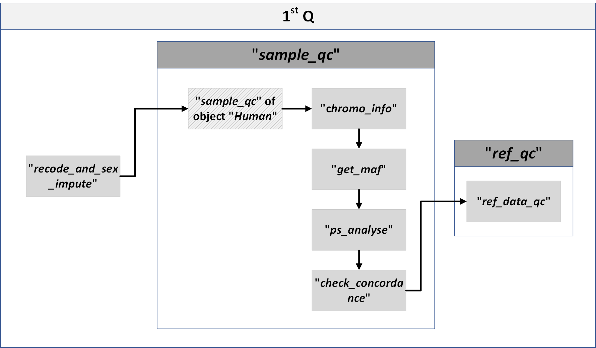

## 1st Q

### The 1st Q is mainly implemented by the “sample_qc” function in the “modules.py” script.

### For the personal genome:

> 1. <b>recode_and_sex_impute</b>: 
> >	- plink --recode vcf: The user specified genotype file (VCF or PLINK format) is read in and coverted into VCF by PLINK.
> >	- plink --impute-sex: To infer the genetically determined sex

> 2. <b>sample_qc</b>: 
> >	- plink –missing: To calculate missing rate

> 3. <b>chr_and_vep</b>: 
> >	- plink --make-just-bim: To generate a bim file counting the number of SNPs by chromosome.
> >	- python packages pandas & matplotlib: The variants are read in and processed by pandas, and then displayed in bar plot by matplotlib

### For the reference population genome:

> 1.	<b>get_maf</b>:
> >	-	plink --freq: To generate frequency statistics.
> >	-	python packages pandas & matplotlib: The frequency statistics is read in by pandas, and then displayed in histogram by matplotlib

> 2a.	<b>PCA</b>:
> >	-	plink --maf 0.01 --misng 0.01--hwe 1E-50: To retain high quality SNPs
> >	-	plink --indep-pairwise --kb 50kb--r2 0.2: To keep independent SNPs
> >	-	plink --pca –freq: To calculate principal components and SNP frequency
> >	-	plink --read-freq --score no-mean-imputation variance-standardize: To generate PC for the “personal genome”
> >	-	python packages pandas & matplotlib: The principal components result is read in by pandas, and then displayed by matplotlib

> 2b.	<b>UMAP</b>：
> >	-	python package UMAP: To reduce the genetics data into two dimensions
> >	-	python packages pandas & matplotlib: The 2-dimensional result is read in by pandas, and then displayed by matplotlib

> 3.	<b>check_concordance</b>:
> >	-	python package matplotlib_venn: To displayed the venn diagram for variants of two genotypes files.

> 4.	<b>ref_qc</b>, to show the QC result of the reference population.
> >	-	plink --freq --missing --test-missing --hardy --het --check-sex --genome: To get the information of minor allele frequency, missing genotype rates, Hardy-Weinberg equilibrium, heterozygosity rate, sex discrepancy, and cryptic relatedness in reference population.
> >	-	python packages pandas & matplotlib: The information obtained above is read in by pandas, and then displayed in histogram by matplotlib

