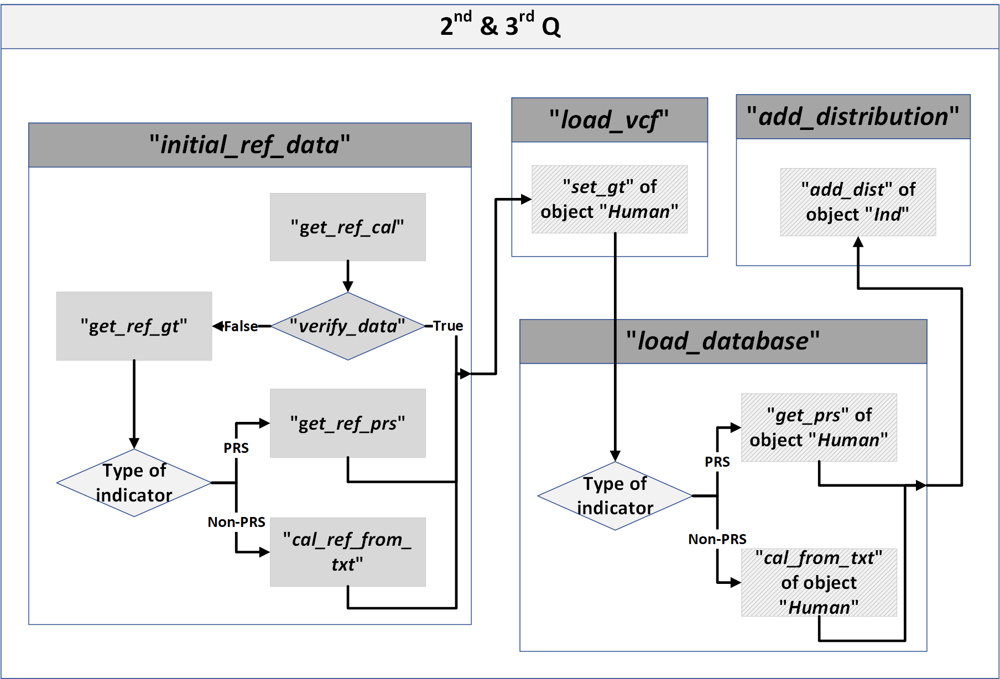

## 2nd Q & 3rd Q
### The 2nd and 3rd Q are processed together.

> 1. <b>initial_ref_data</b>: To obtain the reference population result of the algorithm database
> > - <b>get_ref_cal</b>: To read the previous reference population result file. If the file was corresponding to the current analysis setting using the function <b>"verify_data"</b>, the result would be gotten directly by python package <b><i>pandas</i></b>. Otherwise, a new reference population result would be created using functions "<b>get_ref_gt</b>", "<b>cal_ref_from_txt</b>" and "<b>get_ref_prs</b>"
> >
> > - <b>verify_data</b>: To verify whether the population result is corresponding to the current analysis setting
> >
> > - <b>get_ref_gt</b>: To obtain the genotypes of the reference population in order to calculate the new result
> >
> > - <b>cal_ref_from_txt</b>: To calculate result for algorithms stored in normal text file
> >
> > - <b>get_ref_prs</b>:  To extract PRS result for algorithms stored in GWAS file 
> >
> >   > - `plink --clump --clump-p1 --clump-p2 --clump-r2 --clump-kb`: To extract independent variants from raw GWAS file
> >   > - `plink --score`: To calculate the polygenic risk score for each individual in reference population

> 2. <b>load_vcf</b>: To load the genotype from user genotype file into object “Human”.

> 3. <b>load_database</b>: To calculate the result of algorithm database and store it into object “Human”. 
<b>cal_from_txt</b> and <b>get_prs</b> are used and similar to <b>cal_ref_from_txt</b> and <b>get_ref_prs</b>, but <b>get_ref_prs</b> do not use the “`plink --clump`” to extract independent variants for the list of these variants is already stored.

> 4. <b>add_distribution</b>: To add distribution information for each indicator of user according to the result of reference population. 
In <b>add_dist</b> of object <b>Ind</b>, python packages <b><i>matplotlib</i></b> is used to display the distribution in histogram or pie chart.

 