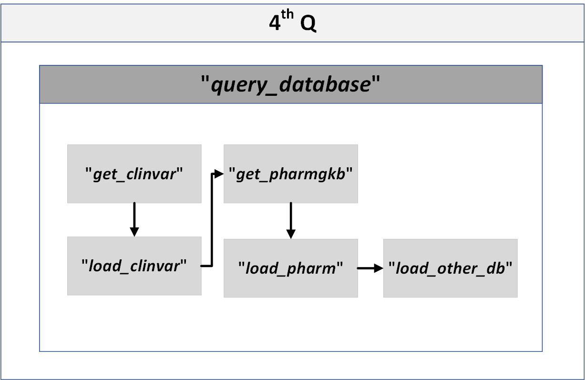

## 4th Q
### The 4th Q is mainly implemented by the “query_database” function in "modules.py".

> 1. <b>get_clinvar_data</b> and **get_pharmgkb_data** are used to download the needed query file. 

> 2.  **load_clinvar** and **load_pharm** are used to query the variants in Clinvar and PharmGKB database.
> 2.  **load_other_database** is used to query the user-defined database. 

