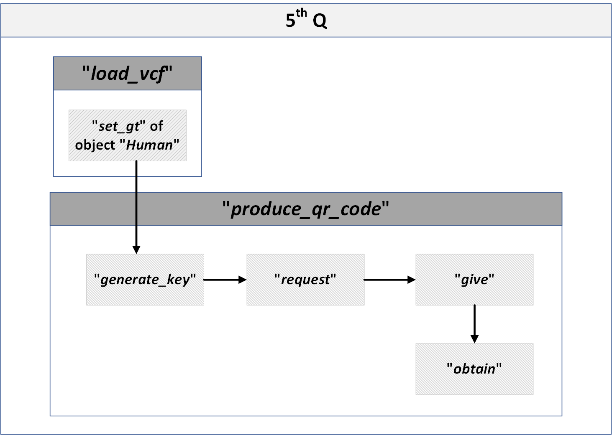

## 5th Q
### The 5th Q is mainly implemented by the “produce_qr_code” function in the “modules.py” script.

> - **generate_key**: Generate public and private key pair
> - **request**: Generate the QR code which contains the list of needed SNPs and public key
> - **give**:  Generate the QR code which contains the genotype of needed SNPs
> - **obtain**: Decode and decrypt the QR code which produced in **give** and store in json file
> - In these subfunctions, python packages ***qrcode*** and ***pyzbar*** are used in encoding and decoding, ***rsa*** and ***pyDes*** are used in encryption and decryption.  

