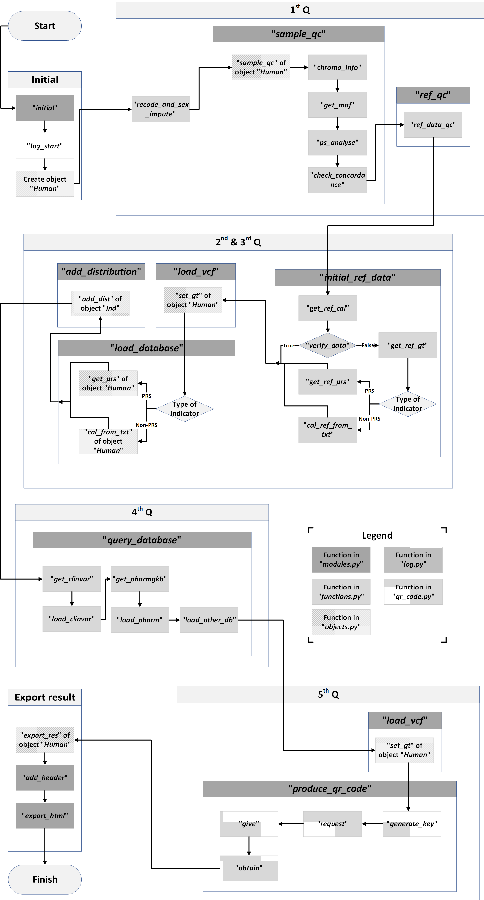

<link href="./markdown.css" rel="stylesheet"></link>

## A detailed technical description of 5-Q

1. <b>[[A complete example|A-complete-example]]</b>
This section presents a completely worked out example.

2. <b>[[Advanced Customization|Advanced Customization]]</b>
This section guides advanced users to customize PAGEANT.

3. <b>[[Anatomy of Q1|Anatomy of Q1]]</b>
This section presents technical details for Q1.

4. <b>[[Anatomy of Q2 Q3|Anatomy of Q2Q3]]</b>
This section presents technical details for Q2 and Q3.

5. <b>[[Anatomy of Q4|Anatomy of Q4]]</b>
This section presents technical details for Q4.

6. <b>[[Anatomy of Q5|Anatomy of Q5]]</b>
This section presents technical details for Q5.

 

